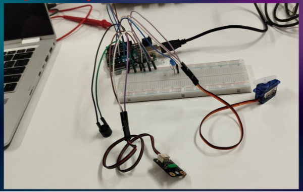
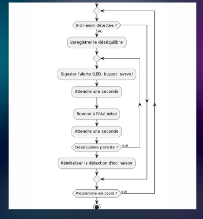

# Intelligent Seismic Detection System

## 📖 Overview
This project involves the creation of an intelligent seismic detection system using an Arduino platform, combined with specific sensors to detect ground vibrations and trigger corresponding actions. The goal is to monitor seismic activities and activate predefined actions such as alerts or automatic system responses when significant vibrations are detected.

## 🛠 Technologies & Components Used
- **Arduino**: The platform used for building the system and processing sensor data.
- **C++**: The programming language used to develop the logic and control the Arduino system.
- **Sensors**: Various sensors, such as vibration or seismic sensors, are employed to detect ground movement.
- **Relay/Actuators**: To trigger actions based on seismic data, such as activating alarms or controlling other systems.

## 📝 Key Features
1. **Seismic Detection**:
   - Utilize vibration or seismic sensors to detect ground movements or tremors.
   - Continuously monitor vibrations and compare them with predefined threshold values.
   
2. **Arduino-based System**:
   - Arduino acts as the central control unit that processes data from the sensors.
   - C++ programming is used to handle sensor data, implement thresholds, and trigger actions.

3. **Triggering Actions**:
   - When a vibration is detected that exceeds the threshold, predefined actions are triggered, such as sending alerts, activating an alarm, or starting safety procedures.
   
4. **Real-time Monitoring**:
   - The system continuously monitors seismic activity, providing real-time responses to potential threats.

## 🛠️ Project Assembly – All Components

This is the montage of the project with all components used:

## 🧩 Logical Diagram of the Project

This is the logical diagram representing how the system components interact:

## 📊 Project Workflow

### 1. Data Collection and Sensor Integration
- **Sensor Setup**: Connect vibration or seismic sensors to the Arduino board to detect ground vibrations.
- **Data Acquisition**: Read sensor data using Arduino and convert raw readings into a usable format (e.g., vibration magnitude).

### 2. Data Processing and Threshold Comparison
- **Threshold Setting**: Define thresholds for different vibration levels that would indicate a potential seismic event.
- **Real-time Processing**: Continuously monitor the sensor input and compare it against the set threshold values.

### 3. Triggering Actions
- **Alert System**: If the vibration level exceeds the threshold, trigger an alert, such as activating a buzzer or sending a message.
- **Safety System Activation**: Optionally, the system can be programmed to activate other safety protocols, such as shutting down machinery or opening emergency exits.

### 4. System Feedback
- **Display Feedback**: Optionally, use an LCD display or serial monitor to show real-time data and system status.
- **Feedback Loop**: After triggering an action, the system can provide feedback or log the event for further analysis.

